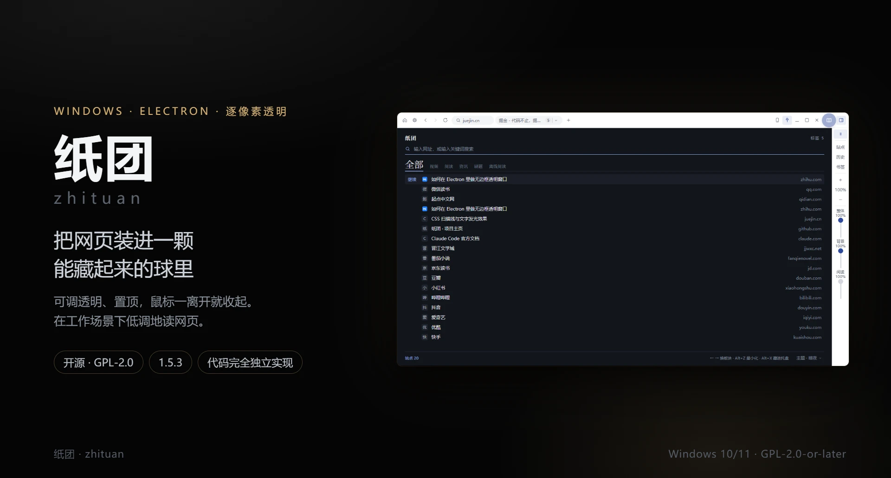
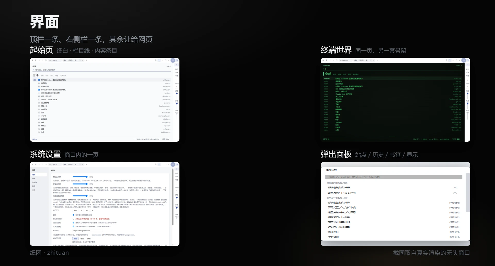
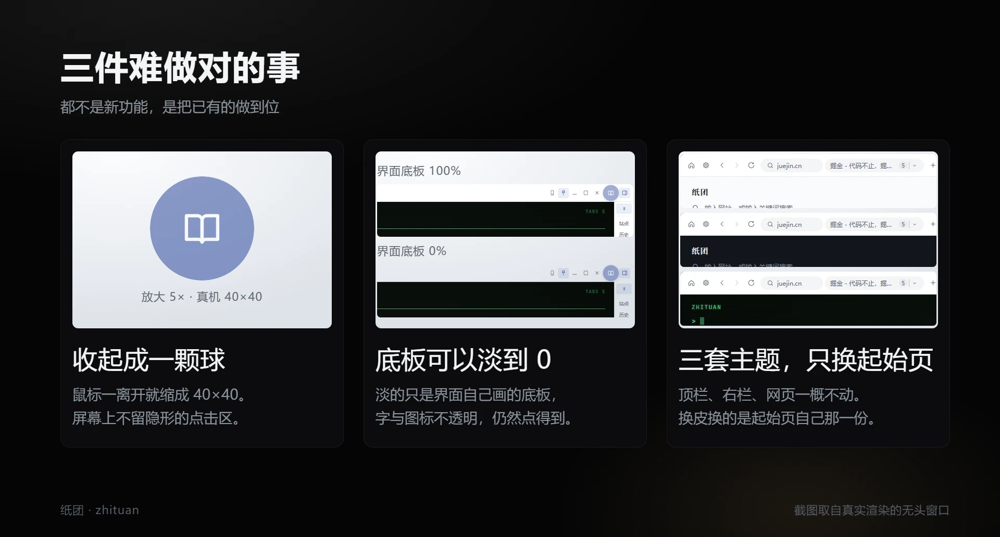

<div align="center">

# 纸团

**把网页装进一颗能藏起来的球里**



[](./LICENSE)
[](https://github.com/m4xlmum/zhituan/releases/latest)
[](https://github.com/m4xlmum/zhituan/releases/latest)

</div>

---

## 这是什么

一个 Windows 桌面阅读器：把网页装进一扇**无边框、逐像素透明、可以置顶**的窗口，
透明度 5%–100% 无级可调；鼠标一移开，整扇窗缩成一颗 40×40 的悬浮球，屏幕上不再有它。

网页、起始页、系统设置都在这**同一扇透明窗**里，各占一块互不干扰的矩形；
顶栏与右侧栏是界面自己的那一层，网页永远不受它影响。

功能对标商业产品 [墨鱼阅读](https://moyuread.com/)，但**代码完全独立实现**，
不包含该产品的任何资源或代码。

当前是 **1.6.8**：里程碑 1（核心摸鱼能力）已完成并通过真机验证。1.3.0 把起始页
重做成一张按栏目分节的报纸页，并让本机的 TXT 与 PDF 直接读得起来；1.3.1 与 1.3.2 是两个
补丁版：前者修掉起始页上「点了没反应」——界面层让回去时没有真的落回最底下，压住了正文区；
后者修掉右侧栏那条「整体透明度」滑块一松手就跳回 100%——配置改了，界面手里那份镜像
却没收到消息。1.3.3 把更新压成**两下**：点过「检查更新」就自己开始下，点过「更新并重启」
就静默装、装完自己回来，中间的向导与第三次点击都去掉了。1.3.4 修掉顶栏那个站点标识：
切进起始页 / 系统设置时它不再跟着变成那一屏的名字，读起来不再像多了一个叫「系统设置」
的标签页。1.3.5 修掉它旁边那一块：窗口窄到标签条让位时，那一枚按钮**分成两处**——
按身子回到它写着的那张网页，只有右端那枚箭头才展开清单。
1.4.0 把 PDF 从 Chromium 内置的阅读器里搬了出来：那一张白纸现在是**逐像素透明**的，
字换成当前主题的墨色，整页浮在桌面上（见下面「离线阅读」一段）。
1.5.0 加上第三条透明度滑块：**阅读透明度**只淡「正在读的那点字」——本机 TXT 与
自家 PDF 阅读页（见下面「离线阅读」一段）。
1.5.1 把主题的边界收回起始页：**只有起始页跟着主题换**，顶栏、右栏、弹出面板、系统设置页
与 PDF 阅读页一律是纸白那套皮。顺带把 1.4.0 那条「字随主题」改回来——磷绿下整本书的字
都变成荧光绿，那是 bug，不是设计（见下面「主题」一段）。
1.5.2 把阅读透明度在 **PDF 那一页**上换了个落点：它原先乘的是画布的 `opacity`，淡的是
**字**；现在调的是**垫在字下面那张纸**——100% 照旧（纸全透），往下拉则一张白纸渐渐补回来，
**字始终是实心的**。默认值没变，老配置一个数都不用迁。
1.5.3 改的只有名字：**摸鱼阅读 / `moyu-reader` → 纸团 / Zhituan**，代码与功能一个字节都没动
（缘由见下面[「关于」](#关于)一段）。升级后第一次启动会把旧的 `%APPDATA%\moyu-reader`
数据搬到新名字下，滑过的透明度、主题、站点清单与网页登录状态都还在。
1.6.0 让 **EPUB 读得起来**：选文件框里多一项，打开一本 `.epub` 会开成自家的阅读页——
分章、目录、上一章 / 下一章、读到末尾，透明度与另外两页落在同一条语义上（**淡的是纸，
字始终是实心的**）。右下角那枚「Aa」能调**字号 / 行距 / 左右留白**，拉一下就重排；
关掉再打开会**接着上次读**（记的是「哪一章 + 章内的百分之几」，不是像素——排版变了
也还在同一处）。解包只用内置的 `node:zlib`，**运行时依赖仍是 3 个**。
1.6.1 换了应用图标：从「蓝底两扇白窗」换成**纸·线描**——一根粗细均匀的线勾出一团纸的
褶皱起伏，深底浅线。笔画最少、存在感最低的一套，缩到 16px 的任务栏里靠轮廓认形；
托盘图标用同一造型的纯剪影。
1.6.2 修一处更新的硬伤：点过「更新并重启」之后，应用**先看三秒再走**——安装程序若
刚启动就退出（真事：上一个版本的安装窗口没关，安装互斥锁让新的在半秒内静默退出），
应用不再跟着消失，提示条会说清原因，修好之后再按一下就重装。在这之前，那种情况
是「应用关了，然后什么都没有」。
1.6.4 有三件事。一是**升级不再被「清不掉旧目录」掐死**：装过旧版再装新版，旧卸载器
要把安装目录里每个文件**改名搬走**，其中一个改不动（桌面装在网盘同步目录里，或者
杀软正在扫 `app.asar`）就整个中止、退出码 2，新版安装器随即弹一个框、升级失败——
重试十次有几次会好，越试越心虚。现在安装器在旧卸载器动手之前先把进程收干净，之后
**失败也不再中断**：自己带重试地把目录清空再覆盖安装。二是**切标签时原视频停下来**：
切到别的标签、进起始页或系统设置，刚才那一页暂停，切回来接着放（只暂停、不闭麦），
见下面[「正在播的音视频会跟着停」](#功能)一段。三是**退出不再吊着**：退出链卡在落盘
那一步时，「更新并重启」会变成「应用关了、然后什么都没有」；现在退出带五秒预算，到点
自己切进程。
1.6.5 有两件事，都落在**本机 TXT**上。一是**顶栏多了一枚「Aa」**：字号、行距、左右留白
三项现在拖得动了（从前它们只长在自家 EPUB 阅读页右下角，而 TXT 那一页是 Chromium 自己
排的，页面上一个控件都挂不上去）。二是修右栏那笔高度账——**「阅读」那条滑块在矮窗口里
有半截落在折叠线以下**，而它下面先是一条窗口缩放手柄：拖到那儿就不再跟手，读起来就是
「拖了一点变化都没有」（量到的账见 [spike-findings Q77](docs/spike-findings.md)）。
三条滑块的轨道现在跟着窗口高度缩，窗口够高时与从前一模一样。
1.6.6 修的是**应用内点「更新并重启」根本没装成**：点下去只有应用关掉，更新没开始，
应用也没回来。**手动双击安装包一直是好的**，所以这件事看着像「随机的」——其实它只在
应用内更新这一条路上发生，一次都没被手动安装碰到过。根因在安装程序自己身上：它收掉旧版
进程时用的是 `taskkill /F /T`，而 `/T` 会**连子进程树一起收**——安装程序正是被它要收的
那个 `zhituan.exe` 用 `spawn` 起的子进程（`detached` 只改进程组，父进程链还在），于是
它死在发出指令的那一刻，后面全都不发生：旧版卸不掉、文件不换、装完把应用叫回来的那一步
也到不了。现在去掉了 `/T`（Electron 的主进程与 renderer / GPU **全部同名**，`/IM` 照样
一枚不漏），升级链路恢复（量到的读数与行为探针见 [spike-findings Q80](docs/spike-findings.md)）。
1.6.7 有三件事，都在起始页与右栏上。一是**起始页上的每一个站点都能改**：页眉右端一枚
「添加」，每一行鼠标停上去就在右端露出「编辑 / 移除」——能改的不只是自己加的，常访问与
内置的热门站点同样能改（改一行在数据上就是把它收成一条自己的站点）。二是**排布三档**：
列表 / 小图标 / 图标，在状态行右端切换，换档记进配置、重开还是那一档。三是右栏里
**「站点」那一格去掉了**（那个面板做的正是起始页现在做的同一件事，两处入口做同一件事，
迟早会有一处先改），空出来的高度给了最上面那两格暂停开关——它们从并排一行改成**上下两格**。
1.6.8 接的是 1.6.6 剩下的一半：1.6.6 修掉的是「安装程序**根本没跑到装**」（它把自己收了），
这一版修的是**「跑到了、却没装上」**。真机上的形态是这样的：安装目录里每个文件都还是上一版的，
**注册表里记的却是新版本号**——应用自己只认文件，于是一遍遍说「有新版本」，
点下去一遍遍重启，看着像更新从来没生效过。根因是旧版的一个文件被退不掉的进程占着
（`resources\app.asar` 既删不掉也改不动），旧卸载器清不掉就整体失败，而安装器没有停下来：
它跳过清场继续铺文件，铺不上去的那些原样留着，版本号却照记。现在三处一起改。安装器在
**动手之前**先问一句「这些文件这会儿删得掉吗」——一次**只问不删**的试探，删不掉就当场停下、
说清是哪个文件被占着、把应用叫回来，一个字节都不改（从前是先卸个半截、再失败、
再留一地半成品）；旧卸载器报的失败码不再让升级整体中止，只被记下来（「清不掉就重装」
比「清不掉就不装」安全）。应用自己也学会读账：去 Windows 的卸载登记里读一遍本机登记的版本号
与安装目录，发现**登记的是新的、跑着的是旧的、而且是同一个目录**，就在提示条与设置页上直说
「上次更新没装成（文件被占用）——重启电脑后再点一次」
（读数与判据见 [spike-findings Q83](docs/spike-findings.md)）。
MOBI / AZW3、自动滚动、按站点插件尚未实现，见[路线图](#路线图)。

## 为什么需要它

上班时间想读点东西，难点不在内容，在于「看起来像在工作」。浏览器摆在那儿本身就是一句话：
占满屏幕、有标签栏、有历史记录、几百兆内存。

纸团把网页放进一个 480×270 的无边框窗口：透明度调到 40% 贴在编辑器旁边，
鼠标一移开它就缩成一颗球，点一下又回来。没有第二个窗口，不在任务栏上，Alt+Tab 里也不多出一行。

收起时窗口是**真的缩到 40×40**，不是把内容藏起来、留一块透明的空壳。因此屏幕上不存在
「看不见却仍在接收点击」的区域——那类区域是最危险的失败模式，它会让本该落进编辑器的
点击被悄悄吞掉。

## 界面



四张都是真实渲染的截图，没有任何手绘或摆拍：第一格是透明的界面层叠在起始页上
（界面那一层是纸白那套），其余三格各是那份文档自己。



三张卡也都是真截图：收起态那颗球、同一块顶栏在「界面底板 100%」与「0%」下的两态、
同一个窗口在三套主题下的样子。最后那张要横着看——**三行的顶栏是同一个像素**，
换的只是顶栏下面起始页那一份（纸白 / 夜色 / 终端世界）。

## 下载安装

到 [Releases](https://github.com/m4xlmum/zhituan/releases/latest) 下载最新一版：
中文安装程序，可以自己选安装目录，不是一键装完那种；也提供 `-x64.zip`，免安装解压即用。
卸载时**保留**用户数据（配置、书签、站点、登录态），重装不至于全丢。

> 安装包没有做代码签名，首次运行时 Windows SmartScreen 可能提示「未知发布者」，
> 点「更多信息 → 仍要运行」即可。介意的话可以直接用 zip 版。

## 功能

**窗口**

- 无边框、逐像素透明、可置顶；**整体透明度** 5%–100%，一条竖直滑块
- **背景透明度**另一条滑块（0%–100%）：只淡界面自己画的底板（顶栏、地址栏、右栏、
  弹出面板），字与图标始终不透明。拉到 0 剩下的是浮在桌面上的一排按钮，仍然看得见、
  点得到；网页与自家页面不受它影响
- **阅读透明度**第三条滑块（0%–100%）：只作用在**正在读的那一份本机文件**上，界面与
  网页都不受影响（见下面「离线阅读」一段）。它在两种本机文件上落的地方不一样：
  **PDF 调的是垫在字下面那张纸**（100% = 纸全透，就是 1.5.2 之前的样子；0% = 一张
  实心白纸铺在这一页下面），**字始终是实心的**；**TXT 调的是正文本身**（那一页的底
  由 Chromium 自己画，我们碰不到，只能把整页淡下去）。前两条什么时候都管得着
  （窗与界面一直在），这一条只在读一本本机文件时才有对象，因此停在网页上时它是
  **禁用的**：灰点、读数照旧，只是这一档改不动它
- 四边与四角都能拖着改大小，**严格 16:9**：拖哪条边，对面那条边钉住不动，另一个方向
  按 16:9 反推。下限是迷你档 480×270，上限是当前显示器的工作区
- 四档尺寸预设：480×270 / 800×450 / 960×540 / 1280×720
- **最大化**铺满当前显示器的**工作区**（不连任务栏那一块），形状随显示器，不保 16:9；
  顶栏、地址栏、右栏一起让位，网页占满整扇窗。退出走右上角那一小块里的还原键，
  或球的右键菜单
- 可选不显示在任务栏与 Alt+Tab 中（默认关闭——开着会显著降低隐蔽性）

**界面**

- 顶栏一条：**起始页 · 系统设置**（最左并排的两颗键）· 后退 · 前进 · 刷新 · 站点标识 ·
  **标签条** · 新标签 · **Aa**（离线阅读的排版，只在读本机文本时可用）；
  右侧是 **手机 · 置顶 · 最小化 · 最大化 · 关闭 · 悬浮球 · 收起右侧栏**
- 功能收在右侧一条 48px 竖栏里：**收起时暂停播放 · 切走时暂停播放**（全栏仅有的两格
  开关，各占一格，上下排在最上面）· 历史 · 书签 · 缩放 · **整体透明度 · 背景透明度 ·
  阅读透明度**。小窗口下这条栈是**会滚的**，排在下面的东西等于藏起来了——那两格开关
  因此排在最上面。1.6.7 去掉了「站点」那一格（起始页自己就能增删改站点，见下面
  「起始页」），空出来的高度正好给了那两格开关：从前它们**并排挤在同一个格子里**
  （48px 宽的栏里一格只有 24px，两枚图标贴着边），现在与下面每一格同宽、一上一下。
  格子数与缝隙数一进一出刚好抵掉（7 格 + 3 条分隔线 + 12 条 2px 缝），因此
  **这条栈的高度账与 1.6.6 一字不差**。三条滑块的轨道长度**按窗口高度算**：够高时
  就是默认档那个 56px，窗口变矮三条一起缩（下限 30px），于是**最底下那条「阅读」滑块
  不会被折叠线裁掉**（从前 903×508 下它溢出 26px，半条轨道够不到，见
  [spike-findings Q77](docs/spike-findings.md)）；矮到 456px 以下才轮到整条栈自己滚
- **顶栏、地址栏、右侧栏、悬浮球都能拖动窗口**，判据只有一条：按在控件（按钮、输入框、
  滑块、标签格）上是操作，按在别处都是拖窗口。可拖区域不会随版面变化而悄悄消失
- 地址栏**默认折叠**在顶栏之下，点顶栏上的站点标识（显示当前域名）展开，不常驻占一行；
  停在起始页 / 系统设置上时那一格显示的是**刚才那张网页**的域名，不跟着变成那一屏的名字
- 顶栏中间是**标签条**：每个网页各占一格，点一下就切过去。放得下全部标签时才显示，
  窄到放不下就整条让位成一个下拉按钮，按钮上写着当前网页的标题——宁可不显示，
  也不显示一条被截断、得横向滚动才能找到想去那一格的
- 让位后那一枚按钮**分了两处**：按**身子**回到它写着的那张网页，右端那枚**箭头**才展开清单。
  停在起始页 / 系统设置上时标签格看不见，它是回到网页的唯一入口——按一下就该回去，
  何况那一档下按钮上的字一个字都不变（写的仍是刚才那张网页，不是那一屏的名字）
- 历史 / 书签 / 缩放 / 标签页 / 排版是五张**独立的弹出面板**（能盖在网页上），
  点了面板以外的任何地方（网页、右栏、别的程序）或按 Esc 就自己收起，同一颗键再点一次
  还是收起
- 站点清单**不在这一栏里**（1.6.7 起）：起始页自己就能添加、编辑、移除，同一件事不再
  开两处入口

**主题**

- **三套主题只管起始页那一页**：栏目线、内容条目、状态行跟着换。顶栏、地址栏、标签条、
  右侧栏、悬浮球、弹出面板、系统设置页、PDF 阅读页**都是固定的一套皮**（纸白那套现代皮），
  换主题一个像素都不动。这是 1.5.1 定的边界——顶栏与右栏是**工具**，工具的样子不该
  因为一页换了皮就跟着变；更要紧的是 PDF 那一页画的是**内容**，墨色跟着主题走的话，
  磷绿下整本书的字都会变成荧光绿
- 同一副骨架：纸白与暗夜是浅色／深色的现代皮（圆角、站点图标），磷绿是荧光屏皮
  （等宽字、直角、扫描线、字发光）。**划分与操作三套完全一致**，换主题不必重新学一遍。
  形态那一层（直角、等宽、扫描线）跟着主题一起只落在起始页上，因此磷绿那一套是
  「**起始页**是一块荧光屏」，不是「整个窗口是一块荧光屏」
- **网页本身永远不受影响**——这一条是硬边界，与上面那条是同一个道理
- 层级不用色块、不用卡片、不用阴影，全部由字号、字重、细线与那根 2px 强调色短线承担
- 入口：起始页最底下那条状态行的右端，系统设置 → 通用里也有一个

**起始页**

- 一页**按栏目分节的报纸页**：顶上一条栏目线（**全部 / 视频 / 阅读 / 资讯 / 刷题 /
  离线阅读**），点哪一栏底下就换成哪一栏的东西
- 每一栏里该有谁是有规矩的，不是按关键词猜的：**「全部」含所有栏的站点且按域名去重，
  单栏只含本栏的站点**；归属由内置站点表按**注册域**反查，认不出的域名只出现在「全部」里。
  **你自己加的站点与浏览历史不需要配置任何东西**，有域名就自动归栏
- 一个搜索框（输入网址直开，否则走搜索引擎；搜索时跨全部板块过滤）、「继续上次」、站点清单
- 站点顺序遵循浏览器惯例：自己固定的 → 常访问的 → 预置的热门站点，同一个域名只出现一次
- **这一页上的每一个站点都能改**（1.6.7）：页眉右端一枚**添加**，每一行**鼠标停上去**
  就在右端露出**编辑 / 移除**两枚。能改的不只是「我的站点」——常访问与预置的热门站点
  同样能改：改一行在数据上就是**把它收成一条自己的站点**（那两处本来没有记录可改），
  换了域名时原来那一行会一并消失，不会过一会儿又顺着历史顶回来
- **移除一行就是让那个域名别再出现**：记进一份「被移除的站点」名单，三个来源一律照它过滤，
  所以删掉的是**那一行**，不看你删的是自己加的还是它推给你的。添回来（或者改回那个域名）
  就把它从名单里划掉
- **排布三档**，在状态行右端：**列表**（一格一行，名称 + 地址）、**小图标**、**图标**。
  三档共用同一套键盘：↑↓ 走行、←→ 在网格里走格；搜索框里那对左右键照旧是换板块。
  换档记在配置里，重开还是那一档
- 入口是顶栏左上角那颗键，它同时是出口——再点一次回到刚才那张网页。它**不是一张标签页**：
  不占标签条上的一格，也没有 ✕

**离线阅读**

- 「离线阅读」那一栏里有一行**「打开文件…」**，按下去弹的是**系统的选文件框**；
  选中的 **TXT / PDF / EPUB** 各开成一张标签页直接读——TXT 交给 Chromium 自己渲染，
  PDF 与 EPUB 走自家的阅读页（见下面两条）
- **PDF 是自己排的**（pdf.js，Apache-2.0）：每一页画进一张画布，然后把**纸收掉、只留字**
  ——一张白纸在桌面上是逐像素透明的，字是**一份固定的近黑墨**，不跟主题换色（1.5.1 改的：
  这一页画的是内容，内容不该被界面的皮肤染上颜色——在那之前磷绿下整本书的字都是荧光绿）。
  做这一条的起因是 Chromium 内置的阅读器改不动：
  那一张纸是它画在插件表面上的，注入的 CSS 与滤镜一个像素都落不上去（实测 12 万个
  像素里 0 个透明，见 [docs/spike-findings.md](docs/spike-findings.md) 的 Q51）
- **代价明写**：彩色会被放弃——插图与彩色标题按**深浅**变成一块墨，颜色没了。换来的
  是一份在什么主题下都读得下去的正文，这是这一版的取舍，不是漏掉了
- 一次一页，宽度铺满正文区；页比窗口高时先滚、滚到头再翻页，于是滚轮与方向键在读长页时
  都还是「往下看」的意思。滚轮、空格、↑↓、PageUp/Down、←→、Home/End 都能用
- 右下角一条浮层写着「第几页 / 共几页」，旁边那枚键改「纸的深浅」——**自动 / 浅底 / 深底**
  循环。深底浅字的 PDF 它自己认（按整页的底色判，把那一页反过来读），认错了就手动顶掉
- 缩放走右栏那条缩放：放大是**重新排版**（字重新排一遍），不是把画面拉大
- **EPUB 也是自己解的**（1.6.0 起）：一本 `.epub` 就是一个 ZIP，用内置的 `node:zlib` 解开
  ——**没有多一个依赖**，运行时依赖仍然是 3 个。从 OPF 里读出章次与目录，一次往页里放一章：
  把那一章的**正文元素**挂进一片 Shadow DOM，书的样式表照样命中它自己的正文（实测
  `margin-top: 48px`、`font-size: 20px` 原样生效，**一个选择器都不用改写**），而书碰我们的
  界面则够不着。上一章 / 下一章、目录（嵌套层级按书里的深度缩进）、读到末尾回目录；
  滚轮、空格、↑↓、PageUp/Down、←→、Home/End 都能用
- **书页右下角那枚「Aa」调排版**：字号（14–26px）、行距（1.4–2.4 倍）、左右留白（0–14%）。
  这三条落在书样式表**之后**并带 `!important`——书里动不动就写死 `body { font-size: 20px }`，
  而用户拉一下字号就该看见字变了。拉完**当场重排**，不必重新加载这一章。上下留白与
  `margin` 刻意不动：那是书自己的版式（标题页、诗歌、封面都靠它）
- **本机 TXT 的排版在顶栏那枚「Aa」上**（1.6.5 起）：字号、行距、左右留白三项与书页那一条
  **是同一份配置**，从哪边改结果都一样。这一枚之所以只能长在顶栏上，是因为 TXT 那一页
  没有别的地方可挂控件——它是 Chromium 自己渲染的，整篇文档就是它生成的一个 `<pre>`。
  因此它只在**读本机文本**时可用（PDF 不算：那一页的字是画进画布的，想放大得改缩放）。
  三项写在那 `pre` 上（行内 `!important`，压得过 UA 的 `pre {}`）；**左右留白走 `padding`
  而不是 `width`**——UA 写的 `max-width: none` 会让 `width` 彻底失效，正文会铺成一条
  不换行的横带（见 [spike-findings Q78](docs/spike-findings.md)）
- **打开一本 TXT 的默认样子变了**（1.6.5 起，有意为之）：那三项的默认值（17px / 1.85 / 6%）
  与书页共用，于是 TXT 的正文从 Chromium 给的 13px 等宽字变成 17px——这是两页字号终于
  对齐的那一步（13px 在 903×508 的窗口里读小说本来就偏小）。代价明写：同一本书的文档高度
  随之涨到两倍多，**再长几倍的书在最大档（26px / 2.4）上会够到 Chromium 约 3355 万像素的
  布局上限**
- **关掉再打开，接着上次读**：记的是「书内哪一章 + 章内的百分之几」，落在按本机路径索引的
  一份账里（`userData/reading.json`，与书签、历史同一个住处）。用**比例**而不是像素——
  拉过字号或换个窗口宽度之后，同一段的像素高度就变了，记像素会落在半页之外。而阅读页
  自己始终不知道自己读的是哪个文件（它手里只有一个 token），换算在主进程那一侧做完
- **正文当 HTML 读，不当 XML 读**——这是刻意的：`.xhtml` 走 XML 解析器时，正文里一处非良构
  整页就变成一张解析错误页，而真实世界的书里这种地方很多（实测一本刻意写坏的书，两种解析器
  一个能读、一个只剩报错）。代价是 XHTML 那种 `<div/>` 自闭合写法会按 HTML 的规矩当没闭合处理
- **两个闸挡脚本**：书里的 `<script>`、`iframe`、`on*` 属性在挂进页里之前就被摘掉，阅读页
  自己的 CSP 又是 `script-src 'self'` / `frame-src 'none'` / `object-src 'none'`——一本被拆过的
  书写不动这个程序（实测：两个闸各挡一次，带脚本的章节读起来只有正文）
- **代价明写**：书里相对路径的图片与样式走自家的 `zhituan-book://` 取得到，越界的路径
  （`../../../../etc/hosts` 这种）一律 404；但**带 DRM 的 EPUB（Adobe ADEPT、Kindle）打不开**
  ——那是另一件事，不是漏掉了
- **正文可以单独淡下去**：右栏第三条滑块只作用在**正在读的那一份**上，界面与网页都不受
  影响，于是「界面 100% + 正文 40%」这种搭配成立。三种页各是一种实现——TXT 那一页是
  Chromium 自己渲染的，能碰的只有那一层，于是给 `html` 写一条 `opacity`；PDF 与 EPUB
  那两页是自家排的，**淡的却是那张纸**（见上一条：位图里只剩墨，纸可以当一层元素底色补回来），
  于是拉下去是一张白纸渐渐铺回来，**字一个像素都不动**（1.5.2 改的；EPUB 沿用同一落点，
  纸铺在 Shadow DOM 外面、书的正文底下）。**这一条永远
  不对网页生效**：网页不吃阅读透明度，这是硬边界（`isLocalFile` 一句话分界，
  见 [docs/architecture.md](docs/architecture.md)）
- 框里**只有 TXT / PDF / EPUB 一组，刻意不挂「所有文件」**：挂上之后你能选中一本
  MOBI 或 AZW3，然后看着它变成一次下载——那比选不到更让人摸不着头脑
- **本机文件在界面上只显示文件名，从不显示路径**：`C:\Users\…\Documents\斗破苍穹.txt`
  在这里就是「斗破苍穹」。这个程序的全部意义是别人看不出你在干什么，而一条路径会把你的
  用户名和目录习惯一起摊在屏幕上
- 打开过的本机文件排在那一行底下，按浏览历史倒序；这一栏的读数数的是本机文件，
  不把「打开文件…」这个动作算进去

**系统设置**

- 是**窗口内的一屏**（`zhituan://settings`），与起始页同类：带 preload、能读写配置。
  早先它是一扇独立窗口，而那扇窗口会出现在任务栏与 Alt+Tab 里，等于把「我在摸鱼」写在脸上
- 入口是紧挨着「起始页」的那颗**设置图标**（顶栏最左第二颗），再点一次原路返回刚才那张网页
- 顶栏藏起来之后这颗键也跟着没了：那时只剩右键悬浮球与托盘菜单里那两项「系统设置」

**隐藏策略：收起成悬浮球**

- 鼠标移出窗口后，**整个界面缩成一颗悬浮球**；点击球展开回原样，点球也可以直接拖窗口
- 球面上画什么可以换：**八枚内置图标**（书页 / 眯眼 / 摸鱼 / 咖啡 / 月亮 / 猫 / 代码 / 耳机）
  \+ 一张**自己上传的图**。上传后弹一个方形取景框，拖动平移、滚轮或滑块缩放，
  导出成 128×128 的 WebP；弹窗里另有一枚真实 40px 的预览球。自定义图可以**铺满球面**，
  也可以**中央图案**（球底与描边保留），一个开关切换
- 球平时半透明、悬停变亮，**右键出菜单**：显隐顶部栏 / 显隐右侧栏 / 藏进托盘 /
  系统设置 / 退出（最大化时多一条**还原窗口**在最前——它是这一态下的兜底出口）
- **正在播的音视频会跟着停**，两个场合各有一条规矩：
  **收起时**——收起成球、藏进托盘、最小化，这三种「没露出来」的状态都会把网页里正在播的
  媒体**暂停并静音**，回到展开态再接着放；
  **切走时**——切到别的标签、进起始页或系统设置，刚才那一页**暂停**（只暂停、不闭麦，
  你在别处正放的声音不受影响），切回来接着放。
  两种场合都连 iframe 里的播放器一起，你自己按了暂停的那一些回来时仍然是暂停的。
  两处开关：**右侧栏最上面并排的那两格**，或系统设置 → 隐蔽 → 「收起时暂停音视频」/
  「切走时暂停音视频」

**老板键与托盘**

- 老板键 1（默认 `Alt+Z`）最小化 / 恢复，老板键 2（默认 `Alt+X`）藏进托盘；都可自定义，
  **注册失败时会明确提示**（组合键被其它程序占用时注册会静默失败）
- **单击托盘图标**在「现形」与「收回托盘」之间切换；右键出菜单：现形 / 系统设置 / 退出
- 菜单里的**现形**除了把窗口提到最前，还会把整扇窗的透明度**直接恢复到 100%**：
  点这一条的人多半正是因为窗口淡得看不清了，只提到最前等于没解决问题

**浏览器**

- 内嵌 Chromium，可访问任意网站，登录态跨重启保留
- 地址栏、前进 / 后退 / 刷新、多标签页、「我的站点」+ 内置热门站点
- 浏览历史与书签（本地存储）
- 手机 / 电脑模式切换、页面缩放、隐藏滚动条
- **页面里点视频的全屏键，软件窗口跟着最大化**：视频铺满整屏，而不是只铺满正文那一块、
  顶上还压着一条顶栏。退出（再点一次视频的全屏键、按还原键、拖动窗口、或收起成球）时
  窗口与网页两边一起收拾干净。**反过来不成立**：用户本来就是手动最大化的，看个视频再退出
  全屏，不该把他的窗口缩回去

**隐蔽性**

- 可选的防截屏 / 防屏幕共享（`SetWindowDisplayAffinity`）
- 独立于系统浏览器的会话，不与日常浏览混在一起
- 更新提示只出现在窗口里、不用系统通知（理由见[更新](#更新)）

## 工作方式

一扇 Electron `BaseWindow`，里面叠着若干个 `WebContentsView`：

- **主进程**负责窗口编排与状态机（展开 / 收起 / 贴边 / 托盘），也是所有窗口级属性的唯一入口
- **界面**是铺满整窗的一层——顶栏、右侧栏、弹出面板、起始页、系统设置都是这一层里的几份文档；
  它按状态缩到该在的地方（最大化时只剩右上角一小块）
- **网页**各占一个视图，画在「顶栏之下、右栏之左」那个矩形里，界面与网页互不干扰；
  注入网页的透明样式只对访客页生效，碰不到自家页面；离线阅读的**阅读透明度**也**只给
  本机文件**（`file:`），网页那一侧永远吃不到——两者判据分明。这一条在两种本机文件上
  还走两条通道：TXT 那一页是 Chromium 渲染的，只能由主进程把 `opacity` 写进去（同一条
  注入通道）；PDF 那一页是自家排的、带 preload，值从配置直接读到页面自己手里，
  落在画布的底色上（那张纸）
- **自家页面**（`zhituan://home`、`zhituan://settings`）带 preload、能读写配置，但**不是标签页**：
  它们各是窗口里的一「屏」，各有各的入口键，不进标签条。系统设置因此是窗口内的一页，
  而不是另一扇会出现在任务栏里的窗

这一层叠关系是这个产品最容易踩坑的地方（谁在上面决定了谁能收到点击），
细节在[架构要点](docs/architecture.md)。

## 更新

检查更新走的是 GitHub 的[发布页](https://github.com/m4xlmum/zhituan/releases)：
启动约 20 秒后静默取一次 `latest.yml`（取不到就安静地算了，设置页 → 关于 里写着原因），
比出有更新的版本号后在**窗口里**提示。三件事值得先说清楚：

- **提示只出现在窗口里，不用系统通知。** 这是个隐身软件：系统通知会进通知中心、会上锁屏、
  会被录屏录进去——那等于替你告诉别人「我在跑别的程序」。
- **只问你两次：查一次、重启一次。** 点「检查更新」之后就自己开始下（启动时那次静默检查
  只提示、不下——那 110MB 全部由你发起）；下完校验过，点「更新并重启」即静默安装、
  装完把新版自己启动回来，标签页照旧还原。中间不再有向导，也不再有第三次点击。
- **安装程序没跑起来时，应用不走。** 点过「更新并重启」之后应用会先看三秒再走：安装
  程序若刚启动就退出（最常见的原因是**还有一个没关的安装窗口**——安装互斥锁两个版本
  同一把，新的会被它静默挡下），应用留在原地、提示条说清原因，关掉那个窗口再按一下
  即可。在那之前，这种情况是「应用关了，然后什么都没有」。
- **安装程序不会把自己杀掉**（1.6.6）。上面那条「先看三秒」挡得住「刚起来就死」，挡不住
  「死在自己手里」：安装程序收旧进程时用的是 `taskkill /F /T`，`/T` 连子进程树一起收，
  而它自己就是被收的那个进程的子进程（应用用 `spawn` 起的），于是它一边发指令一边把
  自己收了——表现同样是「应用关了、然后什么都没有」，而且**只在应用内更新时发生**
  （手动双击安装包时它的父进程是资源管理器，根本撞不上）。
- **免安装版（zip）请回发布页手动覆盖。** 它没有安装目录可更新，点「更新并重启」会把新版本
  装成**第二份**（那时删掉旧的那份目录即可）。

升级是**静默**装回**上次那个目录**：装到哪儿由安装程序自己记着（`HKCU` 里那条
`InstallLocation`），因此你当初把第一份装在哪儿，升级就落在哪儿，不会多出一份。首次安装
仍然是向导、仍然能选目录——只有升级不再问你。

下完会对一次 sha512（`latest.yml` 里那个），对不上就把文件删掉——一个来路不明的东西不该
留在「下一步就要执行它」的位置。**但没有代码签名**，所以完整性能保证的只有「HTTPS + 这个
哈希」。每次更新都是**全量下载**（没有差量更新）：差量要一直维护一份 `.blockmap` 并把一个
更新库整个吞下来，而这里是「用户点一下才下」，全量换来的是零新依赖。

## 数据位置

配置、站点、书签、历史与网页登录态都在 `%APPDATA%\zhituan`。配置写入采用
「临时文件 + rename」原子替换；文件损坏时会被隔离为 `.corrupt-<时间戳>` 并回落默认值，
不会因为一个坏文件导致应用起不来。

更新用的安装包下在 `%TEMP%\zhituan-update`：校验不过的那一份当场删掉。

## 路线图

**1.0.0 是里程碑 1（核心摸鱼能力）的收尾**：装得下网页、藏得住窗口、起始页跟着主题走。
下面这些还没做——写在这里，是为了让「现在有什么」与「还没有什么」一眼分得清：

- **MOBI / AZW3 的阅读。**它们既不是 ZIP 也不是 XHTML，与 EPUB 没有一条能共用的路
  （是 PalmDOC / PDB 那一族的容器，KF8 那一段还得自己解 HUFF/CDIC），Chromium 也都不认、
  选中会变成一次下载，因此选文件框里刻意不列它们。要支持只能先转成 EPUB，或者收一个
  第三方的 mobi 解析器——两条都不便宜
- **EPUB 的进度、续读与阅读排版**——**1.6.0 已经做了**：解包、分章、目录、翻章、正文注入、
  那张纸的透明度（Q65 / Q66），加上右下角的「Aa」排版三项与「关掉再打开接着上次读」
  （Q69–Q71 那一族，在真身上量过）
- **PDF 的排版还是固定的**：1.4.0 已经把底色与字色拿回来了（见「离线阅读」），
  字号、行距、页边距、单双页这些还没有。这一页现在是我们自己的了，控件的样子 1.6.0 也已经
  在 EPUB 那一页上立起来（右下角那枚「Aa」），但搬过来**不是同一件事**：那边的字是 CSS 排的，
  改几个自定义属性就重排；这边的字印在位图里，要重排得让 pdf.js 重画一遍
- PDF 里的**链接与目录**不认（这一页只有纸与字），选中文字、复制也还没有
- 自动滚动与定时翻页
- 修改网页文字颜色、隐藏图片与视频
- 按站点插件
- 全屏应用检测：置顶窗口浮在全屏演示之上是一个检测向量，应自动规避

## 从源码运行

需要 Node.js 20 以上。

```bash
npm install
```

```bash
npm run dev
```

## 开发

```bash
npm run typecheck
```

```bash
npm run build
```

```bash
npm run build:win
```

> 开发提示：**DevTools 打开时窗口不透明**（Electron 的既有行为）。调试界面布局时请开
> DevTools，验证透明度相关行为时务必关掉它。

这个产品的相当一部分实现细节是被真机测量倒逼出来的，读一遍能省掉很多「照着直觉改坏」
的时间。它们分在几份文档里：

| 文档 | 里面是什么 |
|---|---|
| [docs/architecture.md](docs/architecture.md) | 二十三处与直觉相反的实现，改动前先读；另附目录与关键文件表 |
| [docs/verification.md](docs/verification.md) | `spike/` 下的探针：看不见屏幕时，怎么把一件件行为量出来 |
| [docs/spike-findings.md](docs/spike-findings.md) | 真机实测的 82 条结论：透明合成、拖动、全屏、托盘、更新网络与安装器、PDF 自渲染与键控、「注进去的样式撤不撤得掉」、阅读透明度为什么能淡纸而淡不到字、「几份文档之间到底有没有继承路径」（主题边界就建在它的答案上），EPUB 这类格式到底能不能导入、「把章节注入自家的阅读页」这个模型立不立得住、「开一本 EPUB 之后视图里到底加载了什么」、「自家的 EPUB 阅读页拿得到那座桥吗」「`var()` 没取到值时那条 `!important` 会压到谁」「探针自己会不会动用户的真数据」，以及「拖了一下没反应」那句抱怨量出来到底是什么（Q77，一条被推到折叠线以下的滑块）、「本机 TXT 的字号该往哪儿写」（Q78，为什么留白只能走 `padding`）、「预览探针为什么在抢用户那个应用的缓存目录」（Q79，量具自己的毛病）、「应用内更新为什么只关掉了应用」（Q80，安装程序被自己的 `/T` 收了）、「起始页上每一个站点都能改」在数据上落成哪几件事（Q81）与右栏那两格开关换了排法之后**还按不按得到**（Q82） |
| [DESIGN.md](DESIGN.md) | 设计系统：起始页那套排版与三套主题（主题只落在起始页上） |
| [PRODUCT.md](PRODUCT.md) | 产品定位与取舍 |

`spike/` 下的每个探针都能在本机重跑，例如：

```bash
npx electron spike/preview.js --home --body
```

## 许可证

**GPL-2.0-or-later** —— 你可以自由使用、修改与再分发，但衍生作品必须以同样的许可证开源
（GPLv2 或你选择的任何更新版本）。`LICENSE` 文件是 GPLv2 的逐字原文；选择「或更新版本」
这一点体现在 `package.json` 的 `license` 字段与各源文件头部的 SPDX 标识符中。

> 关于「开源」：本项目是**真开源**（OSI 认证许可证），因此**允许他人商用**。
> GPL 限制的是「拿了代码却把改动闭源」，不是「不许赚钱」。

## 关于

由 [@m4xlmum](https://github.com/m4xlmum) 维护。这是一个个人项目，但 issue 与 PR 都欢迎
——尤其是真机上的异常行为，很多约束就是这么发现的。

**关于名字。** 本项目原先叫「摸鱼阅读」，**自 1.5.3 起更名为纸团**，代码与功能没有任何变化。
改名的原因很实际：`moyu-reader` 这个名字在 GitHub 上另有至少两个同名仓库，搜不到自己；
而「纸球」这个更贴切的名字在中文 App 市场已被一个同名应用占用。

与商业产品[墨鱼阅读](https://moyuread.com/)功能对标，**但没有任何代码、资源或设计稿上的
关系**：会去看它，是为了知道「一个摸鱼阅读器该有哪些能力」，不是为了让两边长得一样。
